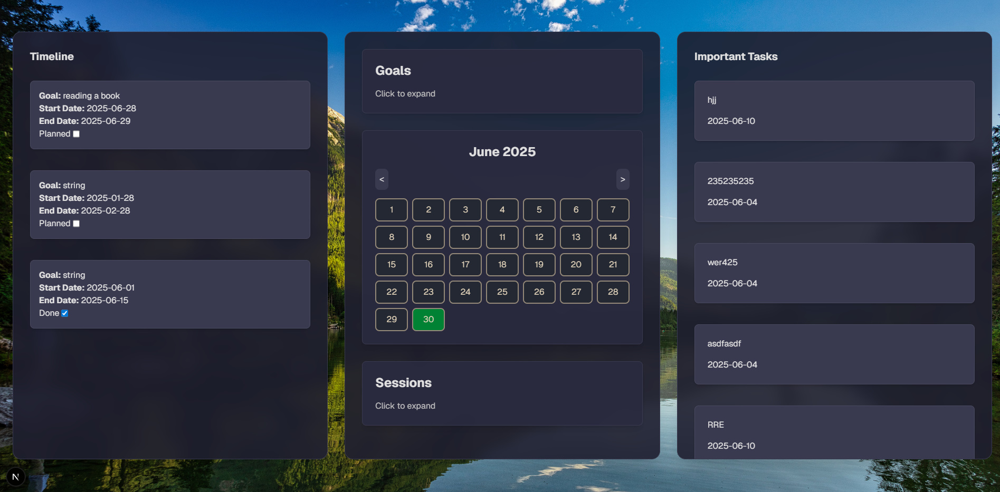
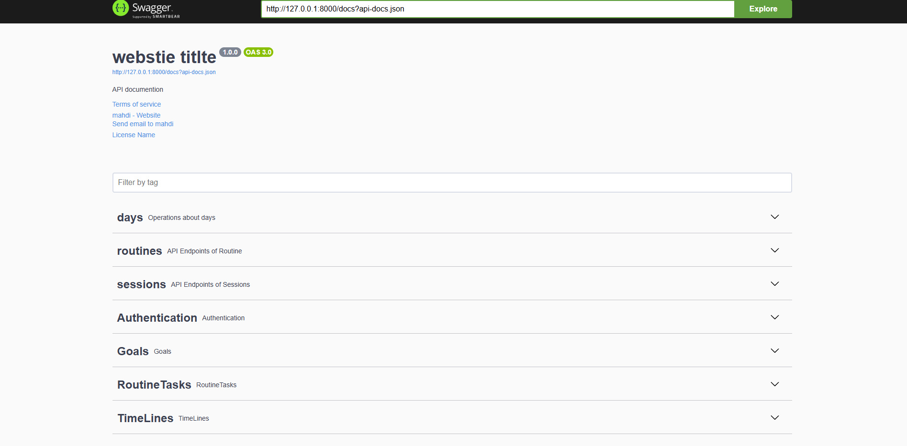

# CH - Next.js Project

This is a [Next.js](https://nextjs.org) project designed to manage goals, tasks, sessions, and timelines. It provides a visually appealing interface for organizing and tracking daily activities.

## Features

- **Goals Management**: Add, update, and track goals with deadlines and statuses.
- **Task Management**: View and manage tasks for specific dates.
- **Calendar**: Interactive calendar for selecting dates and viewing associated tasks.
- **Sessions**: Create and manage sessions with detailed content.
- **Timelines**: Track progress and status of timelines.

## Getting Started

### Prerequisites

Ensure you have the following installed:

- Node.js
- npm, yarn, pnpm, or bun (package managers)

### Installation

1. Clone the repository:

git clone https://github.com/MrMahdiSh/CH

2.Navigate to the project directory:

cd CH

3.Install dependencies:

npm install
# or
yarn install
# or
pnpm install
# or
bun install

Development
Start the development server:

npm run dev
# or
yarn dev
# or
pnpm dev
# or
bun dev

Open http://localhost:3000 in your browser to view the application.

Build
To build the project for production:

npm run build

Start
To start the production server:

npm run start

API Integration
This project integrates with a backend API hosted at http://127.0.0.1:8000. Ensure the backend is running before using the application.

Learn More
To learn more about Next.js, take a look at the following resources:

Next.js Documentation - Learn about Next.js features and API.
Learn Next.js - Interactive Next.js tutorial.
Deployment
The easiest way to deploy your Next.js app is to use the Vercel Platform. Check out the Next.js deployment documentation for more details.
